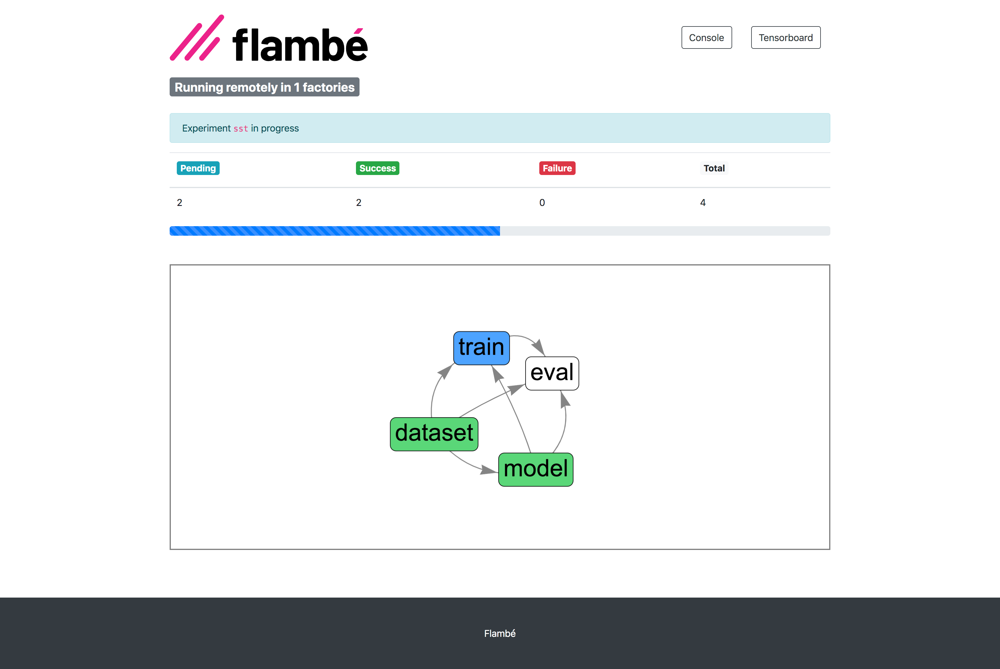

=================
Welcome to Flambé
=================

Welcome to Flambé, a `PyTorch <https://pytorch.org/>`_-based library that allows
users to:

* Run complex experiments with multiple training and processing stages.
* Search over an arbitrary number of parameters and reduce to the best trials.
* Run experiments remotely over many workers, including full AWS integration.
* Easily share experiment configurations, results and model weights with others.

Visit the github repo: https://github.com/Open-ASAPP/flambe

**A simple Text Classification experiment**

.. code-block:: yaml

    !Experiment

    name: sst-text-classification

    pipeline:

      # stage 0 - Load the Stanford Sentiment Treebank dataset and run preprocessing
      dataset: !SSTDataset
        transform:
          text: !TextField
          label: !LabelField

      # Stage 1 - Define a model
      model: !TextClassifier
          embedder: !Embedder
            embedding: !torch.Embedding  # automatically use pytorch classes
              num_embeddings: !@ dataset.text.vocab_size
              embedding_dim: 300
            embedding_dropout: 0.3
            encoder: !PooledRNNEncoder
              input_size: 300
              n_layers: !g [2, 3, 4]
              hidden_size: 128
              rnn_type: sru
              dropout: 0.3
          output_layer: !SoftmaxLayer
              input_size: !@ model.embedder.encoder.rnn.hidden_size
              output_size: !@ dataset.label.vocab_size

      # Stage 2 - Train the model on the dataset
      train: !Trainer
        dataset: !@ dataset
        model: !@ model
        train_sampler: !BaseSampler
        val_sampler: !BaseSampler
        loss_fn: !torch.NLLLoss
        metric_fn: !Accuracy
        optimizer: !torch.Adam
          params: !@ train.model.trainable_params
        max_steps: 10
        iter_per_step: 100

      # Stage 3 - Eval on the test set
      eval: !Evaluator
        dataset: !@ dataset
        model: !@ train.model
        metric_fn: !Accuracy
        eval_sampler: !BaseSampler

    # Define how to schedule variants
    schedulers:
      train: !tune.HyperBandScheduler

The experiment can be executed by running:

.. code:: bash

    flambe experiment.yaml

.. tip::
    All objects in the ``pipeline`` are subclasses of :class:`~flambe.compile.Component`, which
    are automatically registered to be used with YAML. Custom :class:`~flambe.compile.Component`
    implementations must implement :meth:`~flambe.compile.Compile.run` to add custom
    behavior when being executed.

By defining a cluster:

.. code-block:: yaml

    !AWSCluster

    name: my-cluster  # Make sure to name your cluster

    factories_num: 2 # Number of factories to spin up, there is always just 1 orchestrator

    factories_type: g3.4xlarge
    orchestrator_type: t3.large

    key: '/path/to/ssh/key'
    
    ...

Then the same experiment can be run remotely:

.. code:: bash

    flambe experiment.yaml --cluster cluster.yaml

Progress can be monitored via the Report Site (with full integration with Tensorboard):

**Getting Started**

Check out our :ref:`Installation Guide <starting-install_label>` and :ref:`starting-quickstart_label` sections to get up and
running with Flambé in just a few minutes!

.. toctree::
   :maxdepth: 2
   :hidden:
   :caption: Getting Started

   starting/install
   starting/usage
   starting/motivation

.. toctree::
   :maxdepth: 2
   :hidden:
   :caption: Understanding Flambé

   understanding/component
   understanding/runnables
   understanding/experiments
   understanding/report_site
   understanding/extensions
   understanding/clusters
   understanding/builder
   understanding/security
   understanding/advanced

.. toctree::
   :titlesonly:
   :hidden:
   :caption: Tutorials

   tutorials/script
   tutorials/custom
   tutorials/multistage
   tutorials/ssh_cluster
   tutorials/aws_cluster

.. toctree::
   :titlesonly:
   :hidden:
   :caption: Package Reference

   autoapi/flambe/dataset/index
   autoapi/flambe/cluster/index
   autoapi/flambe/compile/index
   autoapi/flambe/dataset/index
   autoapi/flambe/experiment/index
   autoapi/flambe/export/index
   autoapi/flambe/field/index
   autoapi/flambe/learn/index
   autoapi/flambe/logging/index
   autoapi/flambe/metric/index
   autoapi/flambe/model/index
   autoapi/flambe/nlp/index
   autoapi/flambe/nn/index
   autoapi/flambe/runnable/index
   autoapi/flambe/runner/index
   autoapi/flambe/sampler/index
   autoapi/flambe/tokenizer/index
   autoapi/flambe/vision/index
