==================================================
Creating a cluster using Amazon Web Services (AWS)
==================================================

:class:`~flambe.cluster.AWSCluster` is a :class:`~flambe.cluster.Cluster` implementation that uses
`AWS <https://aws.amazon.com/>`_ as the cloud service provider.

This tutorial will guide you step by step to create your first AWS-based cluster in flambé.

Setting up your AWS account
---------------------------

.. important::
    If you are already familiar with AWS main concepts (Subnets, type of instances, security groups, etc)
    and you have your AWS account set up, then feel free to skip this section. **Consider that your Account
    should be able to:**

    * Have a key pair to access instances.
    * Create instances with automatic public IPs.
    * Connect through SSH from the outside world.
    * Have the security credentials and configuration files locally.

    If any of this requirements is not met, please review the following steps.

You will first need to create your AWS account `here <https://aws.amazon.com/account/>`_. Once done, go into the console (https://console.aws.amazon.com).
You should see something like:

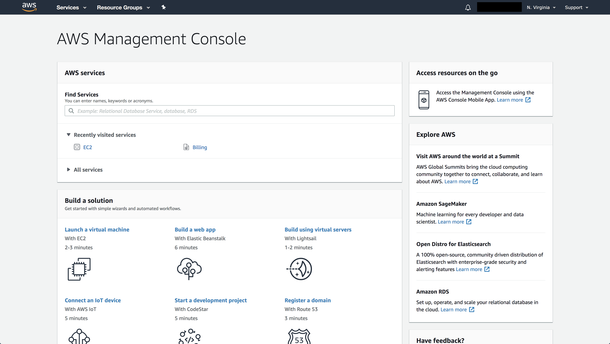

.. attention::
    AWS provides a free tier. If users use this option, the ``timeout`` feature may not be available and only
    basic CPU instances are going to be available.

Create key-pair
~~~~~~~~~~~~~~~

.. important::
    If you already have a key pair feel free to ignore this section.

A key pair will be used to communicate with the instances.

In order to create a Key Pair, go to the **Services -> EC2**:

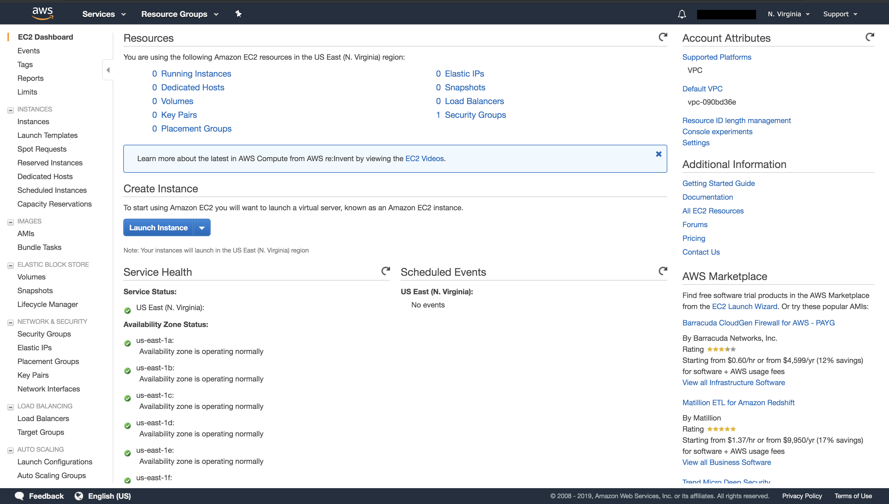

On the left side list, go to **Key Pairs**:

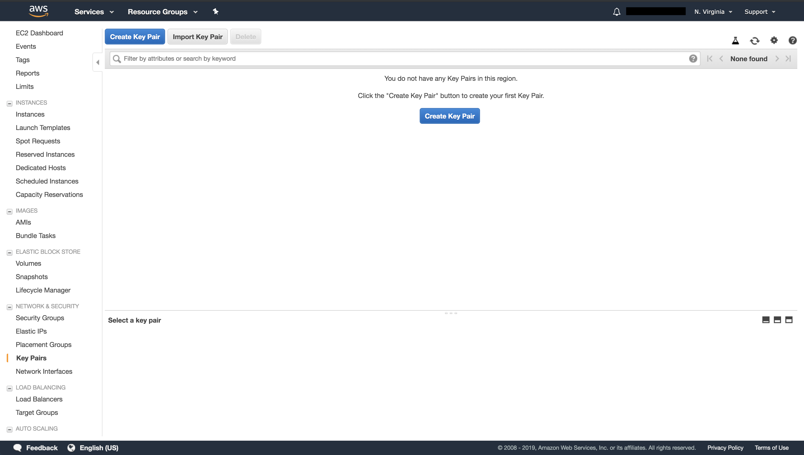

Create a key pair and notice that a **.pem** file will be downloaded:

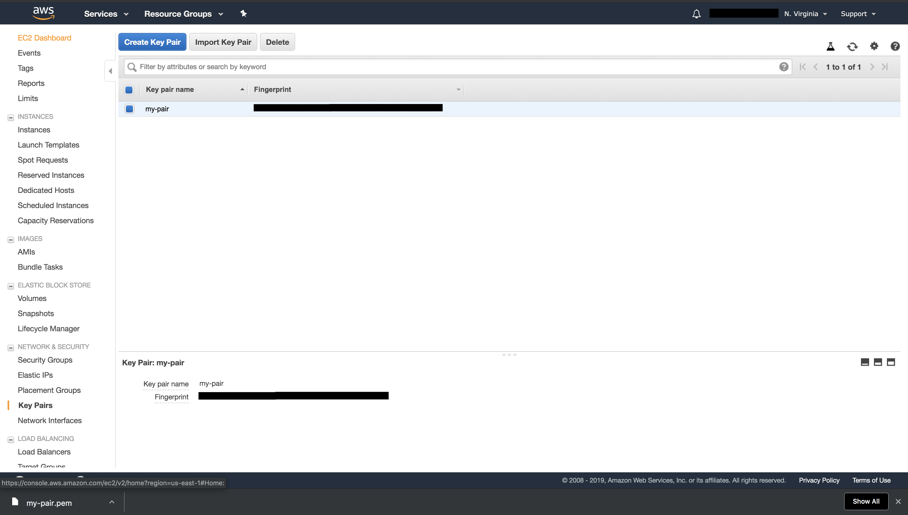

.. important::
    Pick a recognazible name because you will use it later.

.. important::
    Save your **.pem** file in a safe location as AWS will not give you
    access again to the file.

.. warning::
    Set the right permissions to the **pem** file so only the root user can read it:

    .. code-block:: bash

        chmod 400 /path/to/my-pair.pem

Create security credentials
~~~~~~~~~~~~~~~~~~~~~~~~~~~

.. important::
    If you already have security credentials, feel free to skip this section.

Security credentials are a way of authentication additionally to user/password information.
For more information about this, go `here <https://docs.aws.amazon.com/general/latest/gr/aws-security-credentials.html>`_

In order to create the Security Credentials, go to the right top section that contains your name. Press on **My Security Credentials**:

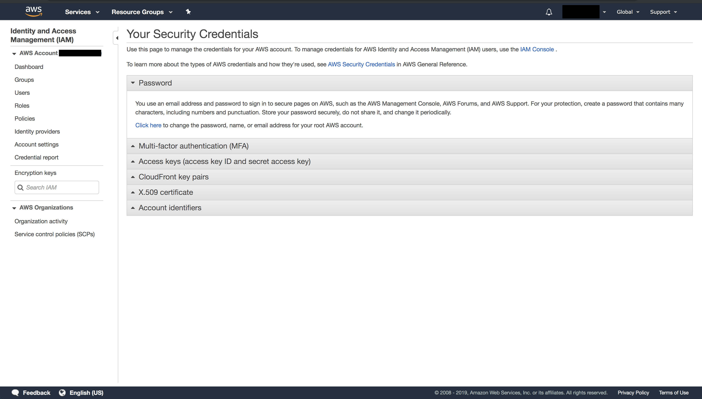

Go to **Access Keys** and click **Create New Access Key**.

When creating them, you should see something like:

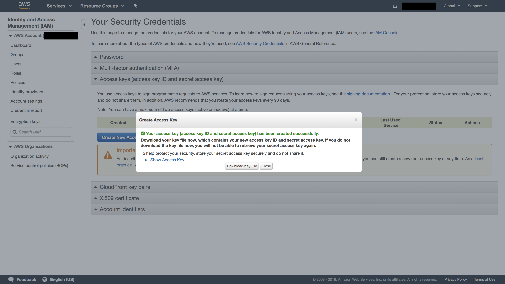

.. important::
    Download the file and make sure you save it in a safe location. **Note that you won't be able to access this information
    again from the console**.

**Basic local configuration**

Having access now to your ``AWS_ACCESS_KEY_ID`` and ``AWS_SECRET_ACCESS_KEY``, you will need to configure 2 configuration files:

.. code-block::
    :caption: ~/.aws/config

    [default]
    region=us-east-1
    output=json

.. code-block::
    :caption: ~/.aws/credentials

    [default]
    aws_access_key_id = XXXXXXXXXXXXXXXXXXX
    aws_secret_access_key = XXXXXXXXXXXXXXXXXXXXXXXXXX

.. tip::
    This is an initial and basic configuration. More information `here <https://docs.aws.amazon.com/cli/latest/userguide/cli-configure-files.html>`_.

.. important::
    At this point, you should have full access to AWS from your local computer through the Security Credentials. This snippet should
    run without raising errors:

    .. code-block:: python
        :linenos:

        import boto3
        sess = boto3.Session()
        sess.client("ec2").describe_instances()  # This may return no content if you have no instances

Create VPC and Subnet
~~~~~~~~~~~~~~~~~~~~~

You will need to create a VPC and a Subnet where your instances will be running. 

.. tip::
    For more information about these topics, go `here <https://docs.aws.amazon.com/vpc/latest/userguide/VPC_Subnets.html>`_

**1: Create VPC**

In order to create a VPC, go to **Services -> VPC**. On the left side, go to **VPC**:

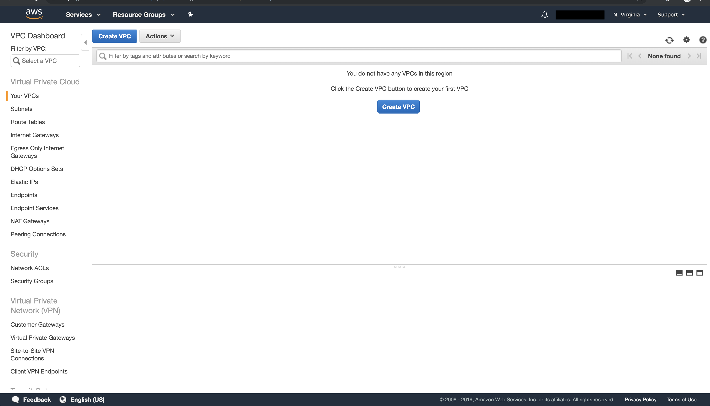

Click on **Create VPC** and choose some values. For example:

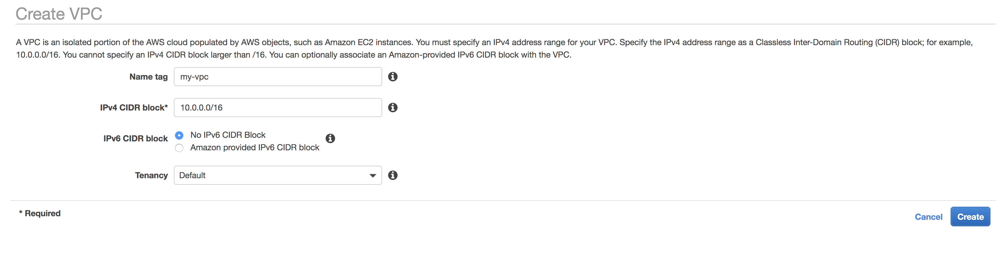

**2: Create Subnet**

In order to create a Subnet, go to **Services -> VPC**. On the left side, go to **Subnet**:

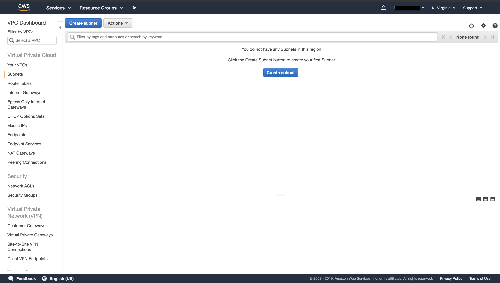

Click on **Create Subnet** and choose some values. Make sure to reference the **VPC** you just created:

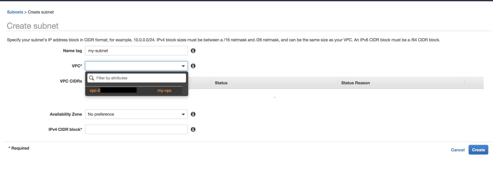

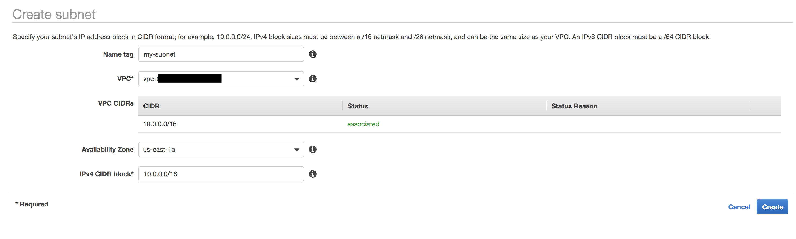

**3: Enable auto-assign public IPs**

This feature allows AWS to automatically assign public IPs to hosts that are created.

.. important::
    This feature needs to be enabled for flambé.

First, go into your **VPC** section and select the **VPC** you created in the first step.
select **Actions -> Edit DNS Hostnames**:

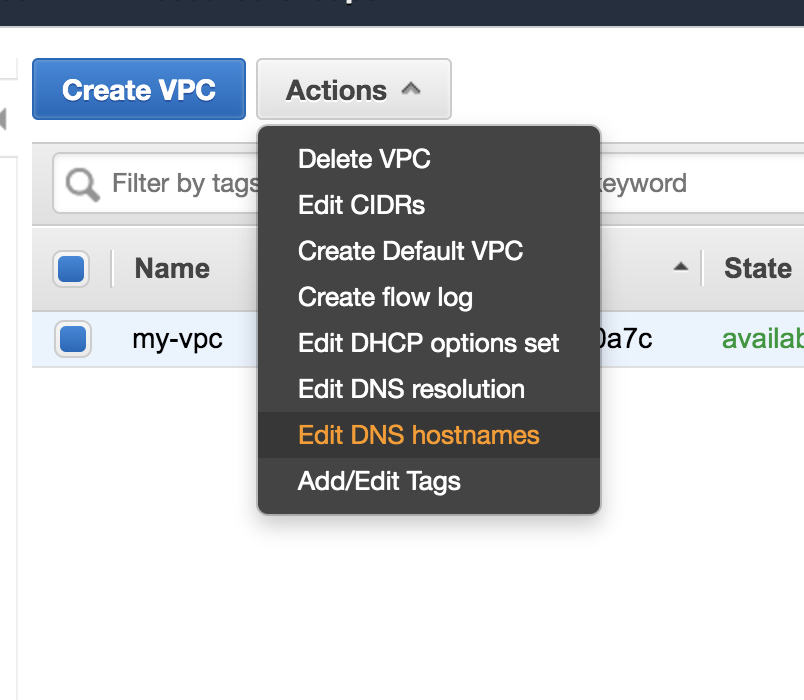

Check on **enable** and click **Save**.

After that, go to your **Subnet** section and select the **Subnet** you created in step 2.
select **Actions -> Modify auto-assign IP settings**:

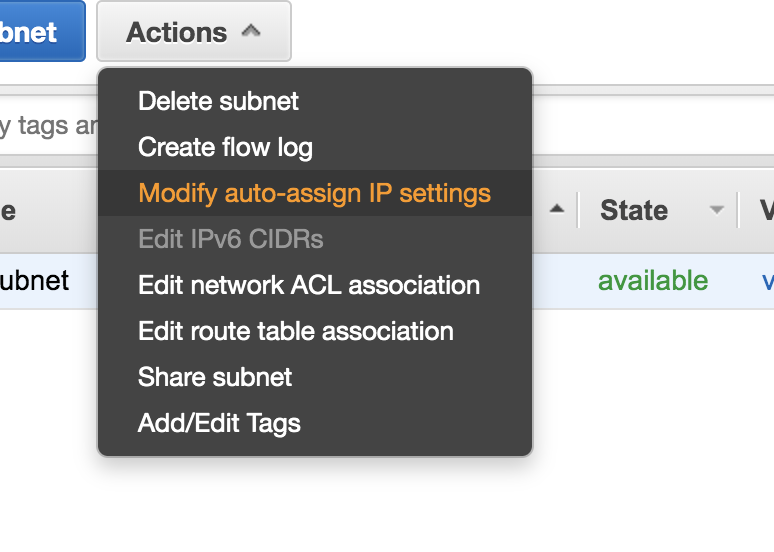

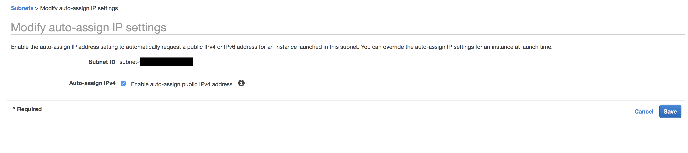
 
Enable the feature and click **Save**.

**3: Configure Internet Gateways and Routes**

Go to **Services -> VPC** and choose **Internet Gateways**. Verify that there is an internet gateway attached to your VPC.
Otherwise, choose **Create Internet Gateway**:

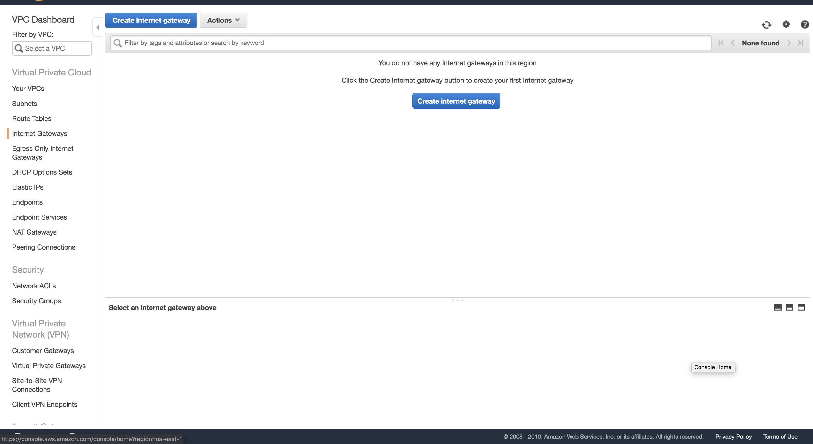

After creating the internet gateway, go to **Actions -> Attach to VPC**. Follow the instructions to attach it to the created **VPC**:

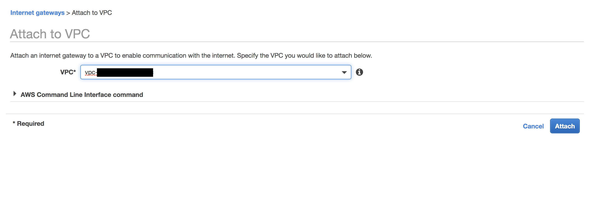

Finally, go to **Subnet** section and select your **Subnet**. On the **Route Table** tab, verify that there is a route with ``0.0.0.0/0``
as the destination and the internet gateway for your **VPC** as the target.

Otherwise, choose the ID of the route table (``rtb-xxxxxxxx``) to navigate to the **Route Table**. On the **Routes tab**, choose **Edit** routes.
Choose **Add route**, use ``0.0.0.0/0`` as the destination and the internet gateway as the target. Choose **Save routes**.

Create Security Group (SG)
~~~~~~~~~~~~~~~~~~~~~~~~~~

Security groups define security policies for the instaces. For more information go `here <https://docs.aws.amazon.com/AWSEC2/latest/UserGuide/using-network-security.html>`_

In order to create a SG, go to **Services -> EC2**. Click **Security Groups** on the left panel and then **Create Security Group** .

.. important::
    The SG must have at least SSH access using standard port 22.

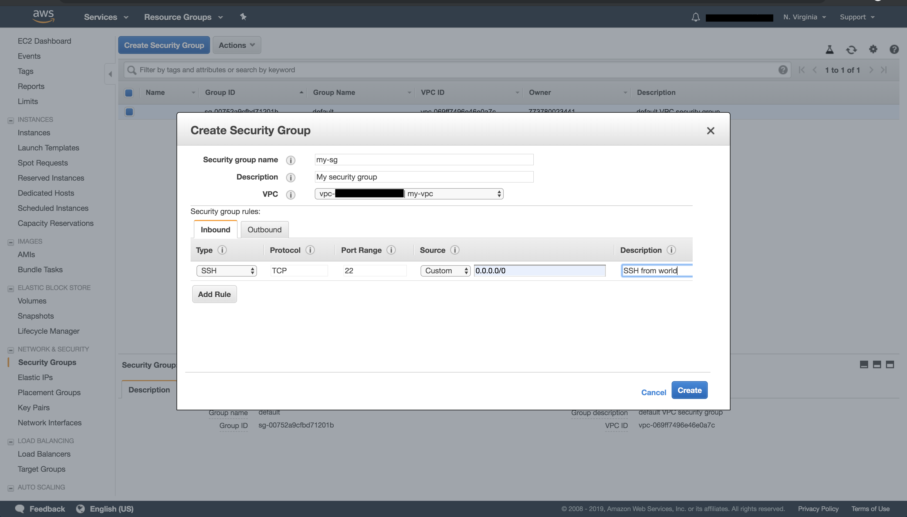

.. tip::
    The above image shows the SG allows ssh traffic from ``0.0.0.0/0`` (which means from everywhere). If you are under static
    public IP or VPN, you can make more secure rules.

.. important::
    If this cluster will be running remote :class:`~flambe.experiment.Experiment`, you may also want to open HTTP ports
    ``49556`` and ``49558`` for the Report Site and Tensorboard.

Creating a ``AWSCluster``
-------------------------

At this point you should be ready to create your :class:`~flambe.cluster.AWSCluster`. You will need:

* The name of the key pair
* The location of the **pem** file and make sure that it has only reading permissions for root.
* The appropriate Security Group's ID
* The Subnet ID you wish all instances to live in.

**Template**:

.. code-block:: yaml
    :caption: aws-cluster.yaml

    !AWSCluster

    name: my-cluster

    factories_num: 2

    # Type of machines.
    factories_type: t3.small
    orchestrator_type: t3.small

    # Set timeouts for autmatic shutdown
    orchestrator_timeout: -1
    factories_timeout: -1

    creator: user@company.com  # Pick whatever you want here

    # Name of my key pair
    key_name: my-pair

    # Specify you pem location
    key: /path/to/my-pair.pem

    # You can add additional tags. This is OPTIONAL.
    tags: 
        project: my-project
        company: my-company

    # Specify the Subnet ID
    subnet_id: subnet-XXXXXXXXXXXXXXX

    # The amount of GB for each instance.
    volume_size: 100

    # Specify the SG ID
    security_group: sg-XXXXXXXXXXXXXXX

Create the cluster by executing:

.. code-block:: bash

    flambe aws-cluster.yaml

You should see something like:

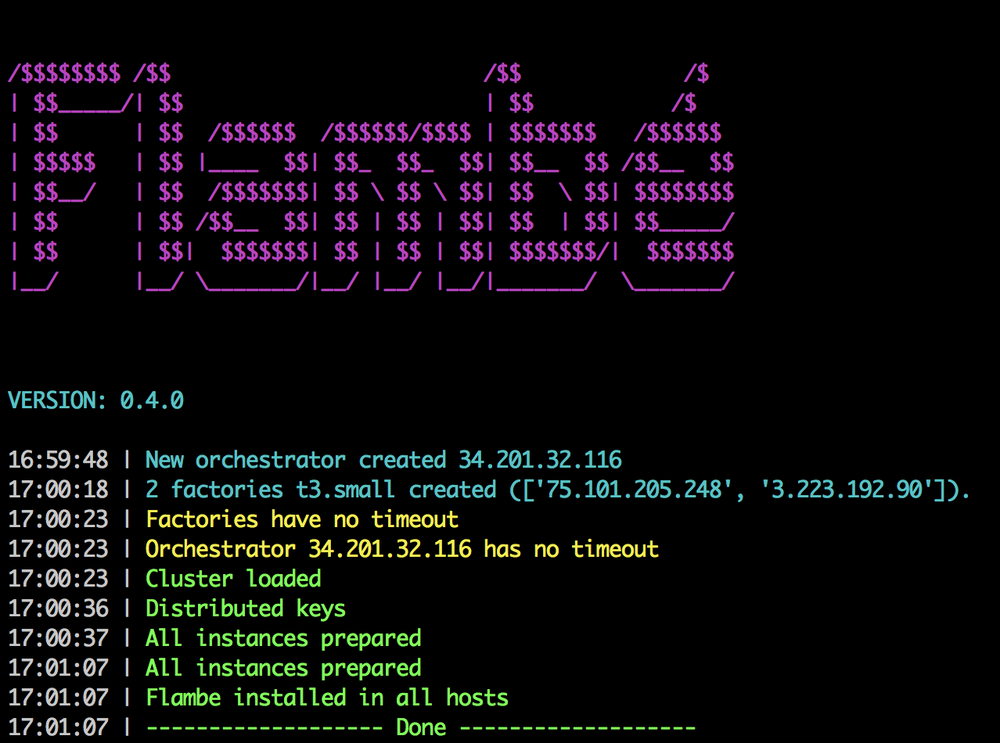

If everything is successfull, you should see you instances in your **EC2** console:

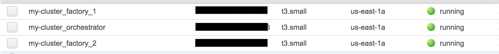

Reusing a ``AWSCluster``
-------------------------

As long as the cluster name hasn't change, you can reuse the same cluster. So if after creating a cluster
like the previous one you execute again:

.. code-block:: bash

    flambe aws-cluster.yaml

Then flambé will automatically detect an existing cluster and it will reuse it:

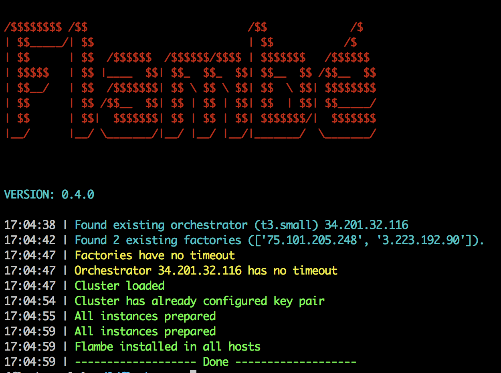

.. tip::
    This is particularly useful when running :class:`~flambe.experiment.Experiment` objects in the cluster.
    While you cannot run multiple experiments in the same cluster simultaneously, you can run them sequentially
    without having to set up the cluster again like the following:

    .. code-block:: bash
    
        flambe experiment.yaml -c my-cluster.yaml
        # after experiment is done...
        flambe other_experiment.yaml -c my-cluster.yaml
