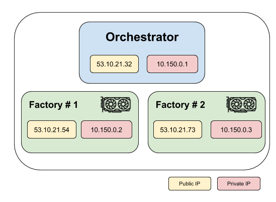

==========================================
Creating a cluster with existing instances
==========================================

Flambé provides a :class:`~flambe.cluster.Cluster` implementation called :class:`~flambe.cluster.SSHCluster`
that is able to build a cluster from existing instances.

.. important::
   As described in :ref:`understanding-clusters_label`, all clusters have an orchestrator host and a set
   of factories hosts.

Instances in a cloud service provider
-------------------------------------

Let's assume that the user contains the following cluster:

.. tip::
    It's not required that the factories contain GPU.

.. important::
   It is required that:

   * All instances are in same private LAN.
   * All host have the same username.
   * All host are accessible with the same private key.

Implementing an :class:`~flambe.cluster.SSHCluster` is as simple as:

.. code-block:: yaml
    :caption: ssh-cluster.yaml

    !SSHCluster

    name: my-cluster

    orchestrator_ip: [53.10.21.32, 10.150.0.1]
    factories_ips:
      - [53.10.21.54, 10.150.0.2]
      - [53.10.21.73, 10.150.0.3]

    key: /path/to/my/key

    username: ubuntu

Note that all hosts have information about both the public IP and the private IP.

Instances in the private LAN
----------------------------

If the instances do not have a public IP because they are running on-premise, then
:class:`~flambe.cluster.SSHCluster` supports providing private IPs only.

For example:

.. code-block:: yaml
    :caption: ssh-cluster.yaml

    !SSHCluster

    name: my-cluster

    orchestrator_ip: 10.150.0.10
    factories_ips:
      - 10.150.0.20
      - 10.150.0.30

    key: /path/to/my/key

    username: ubuntu

More information
----------------

Refer to the :ref:`understanding-clusters_label` section or checkout the documentation of
:class:`~flambe.cluster.SSHCluster`.
