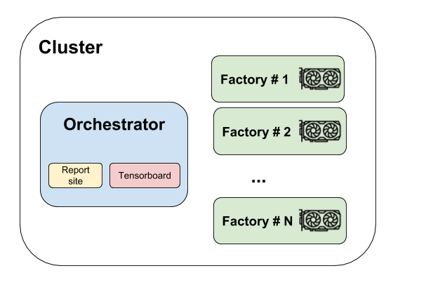

.. _understanding-clusters_label:

========
Clusters
========

Flambé supports running remote ``Runnables`` where jobs can be distributed across a cluster of workers.

.. _understanding-clusters-architecture_label:

Overall remote architecture
----------------------------

**Flambé** will create the following cluster when running a :class:`~flambe.cluster.Cluster`:

**Orchestrator**

The Orchestrator is the main machine in the cluster. The Orchestrator might host
websites, run docker containers, etc. It can also collect artifacts like checkpoints
or logs.

.. attention:: This machine doesn't need to contain a GPU as it does not perform heavy computations.

**Factories**

The factories are instances that are capable of doing heavy computational work and likely need to have GPU resources
(for example, if you're running an :class:`~flambe.experiment.Experiment` with PyTorch and CUDA).

.. important::
    Orchestrator and Factories have private SSH connection with a pair of keys that are create and
    distributed specially for the specific ``Cluster``. More information about this
    :ref:`here <understanding-security-clusters_label>`.

.. _understanding-clusters-launching_label:

Launching a cluster
-------------------

:class:`~flambe.cluster.Cluster` is a special type of :class:`~flambe.runnable.Runnable`
implementation that handles clusters of machines (e.g. AWS instances) that are capable
of running distributed jobs. As with any :class:`~flambe.runnable.Runnable`, you can run a cluster by executing
flambé with the YAML config as an argument:

.. code:: bash

    flambe cluster.yaml

.. attention::
  :class:`~flambe.cluster.Cluster` is an abstract class because it depends on the cloud service provider, so users
  will need to use one of the provided implementations or create a custom one by overriding the abstract methods.

.. important:: We currently provide a full cluster implementation for AWS; see :ref:`understanding-clusters-aws_label`

.. _understanding-clusters-submit_label:

Setting the cluster up
----------------------

All implementations of :class:`~flambe.cluster.Cluster` support setting :attr:`~flambe.cluster.Cluster.setup_cmds`,
which are a list of ``bash`` commands that will run on all instances after creating the cluster:

.. code-block:: yaml

    !XXXCluster

    name: my_cluster

    ...

    setup_cmds:
      - sshfs user@host:/path/to/remote /path/to/local/mount/point  # Mount a remote filesystem
      - pip config set index_url https://my-custom-pypi.com  # Configure PyPI

Note that all commands will run sequentially in all the hosts of the cluster.

.. tip::
    This could be useful for mounting volumes, configuring tools or install binaries.

.. attention::
    If you need more complex setup you can also create your own base images for the hosts.
    :class:`~flambe.cluster.AWSCluster` supports specifying `AMIs <https://docs.aws.amazon.com/AWSEC2/latest/UserGuide/AMIs.html>`_
    for both the Orchestrator and factories.

Submitting Jobs to a Cluster
----------------------------

A cluster is able to run any :class:`~flambe.runnable.ClusterRunnable` implementation, for example :class:`~flambe.experiment.Experiment`
(more information ` in :ref:`cluster_runnables_label`).

Given an `experiment.yaml` config file, running it remotely is as easy as:

.. code:: bash

    flambe experiment.yaml --cluster cluster.yaml [--force]

Flambé will take care of preparing the cluster to run the ``ClusterRunnable`` (in this case an ``Experiment``).

.. important::
  ``--force`` option is necessary when an existing execution is taking place in the
  same cluster and the user wants to override it.

.. important::
  There is no need to run ``flambe cluster.yaml`` before running a ``ClusterRunnable`` in it.
  **If it's the first time using the cluster, flambé will create it for you!**

.. _understanding-clusters-aws_label:

Using AWS
---------

We provide full AWS integration using the :class:`~flambe.cluster.AWSCluster` implementation. When using this cluster, 
flambé will take care of:

* Building the cluster
* Preparing all instances (e.g. installing the version of flambé that matches what the user has locally)
* Automatically shutting the cluster down (if specified)

**How to use AWSCluster?**

A :class:`~flambe.cluster.AWSCluster` is like any flambé :class:`~flambe.runnable.Runnable`
and therefore it can be specified in a YAML format:

.. code-block:: yaml

    !AWSCluster

    name: name-of-the-cluster # Pick a unique identifier for the cluster

    factories_num: 1  # The amount of factories

    factories_type: g3.4xlarge  # The type of factories. GPU instances are recommended.
    orchestrator_type: t3.large # The type of the orchestrator (GPU is not necessary).

    orchestrator_timeout: -1  # # -1 means the orchestrator will have to be killed manually (recommended)
    factories_timeout: -1 # Factories timeout after being unused for these many hours

    creator: user@company
    key_name: aws-key-name

    tags:  # Extra tags to add to all instances
        company: my-company

    key: /path/to/ssh/key

    subnet_id: subnet-abcdef
    volume_size: 100. # GBs of disk space for all instances

    security_group: sg-0987654321

For a full description, see :class:`flambe.cluster.AWSCluster`.

**Automatic shutdown**

This :class:`~flambe.cluster.AWSCluster` implementation provides a way of automatically shutting down all instances that have been created:

.. code-block:: YAML

   !AWSCluster

   # rest of manager config

   orchestrator_timeout: 5
   factories_timeout: 0

These parameters specify **how many hours the resources will persist 
with low CPU consumption.**

In the above example, the Orchestrator will be terminated after 5 hours
of low CPU usage. The Factories will be terminated as soon as CPU usage goes down.

Use ``-1`` to keep the resources alive permanently, or until you manually stop them.

.. seealso::
  For a full example of a configuration file for a Cluster, go `here <https://github.com/ASAPPinc/flambe/blob/master/examples/cluster.yaml>`_.

.. _understanding-clusters-versioning_label:

Intelligent versioning
----------------------

When running ``ClusterRunnables`` remotely, the correct version of Flambé will be installed automatically,
i.e. the version being used locally. For example, if the user has ``flambe==1.2`` installed locally,
then all instances (orchestrator and factories) will be using version ``1.2``!

.. attention::
    This is also valid in developer mode. More on developer mode in :ref:`advanced-debugging_label`.

.. _cluster_runnables_label:

Cluster Runnables
-----------------

A :class:`~flambe.runnable.ClusterRunnable` is a special implementation of a :class:`~flambe.runnable.Runnable`
that is able to execute on a flambé cluster.

The :class:`~flambe.experiment.Experiment` object, for example, is a :class:`~flambe.runnable.ClusterRunnable`.

Users are able to create custom ``ClusterRunnables`` by implementing its interface
(which extends from the ``Runnable`` interface as well).

This new interface requires an additional implementation for the :meth:`~flambe.runnable.ClusterRunnable.setup` method:

.. code-block:: python
    :linenos:

    from flambe.runnable import ClusterRunnable

    class MyClusterRunnable(ClusterRunnable):

       def setup(self, cluster: Cluster,
                 extensions: Dict[str, str],
                 force: bool, **kwargs) -> None:
              # code to setup the cluster 

The :meth:`~flambe.runnable.ClusterRunnable.setup` method should prepare the cluster (which is received as a parameter)
to run the :class:`~flambe.runnable.Runnable` remotely. This usually involves creating folders, downloading resources,
running docker containers, etc.

.. important::
  All :class:`~flambe.cluster.Cluster` implementations provides basic functionality that allow directory creation, running bash commands,
  rsyncing folders, running docker containers and much more. See its documentation for more information about this.

.. hint::
  It’s highly likely that you will need to change some instance attributes in the object in the :meth:`~flambe.runnable.ClusterRunnable.setup` method.
  For doing this, you should use :meth:`~flambe.runnable.ClusterRunnable.set_serializable_attr` to ensure that the attribute change is serializable.

**How to run a ClusterRunnable**

For running a :class:`~flambe.runnable.ClusterRunnable` remotely, you will need to provide a cluster configuration:

.. code:: bash

  flambe cluster_runnable.yaml --cluster cluster.yaml

Because of being :class:`~flambe.runnable.Runnable`, it can still be executed locally:

.. code:: bash

  flambe cluster_runnable.yaml

Remote Experiments
-----------------

Users can get the most of performance by running ``Experiments`` in a ``Cluster``.

In remote ``Experiments``, a **ray cluster** will be created connecting all instances
in the cluster. The Orchestrator will host Tensorboard and the Report Site (the URL will
be provided in the console) and the Factories will do the heavy work executing the ``pipeline``.

Additionally, when running remote ``Experiments``, flambé will take care of uploading the local resources
that were specified, making them available to all instances.
