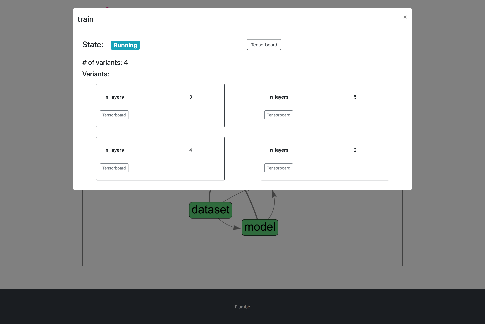
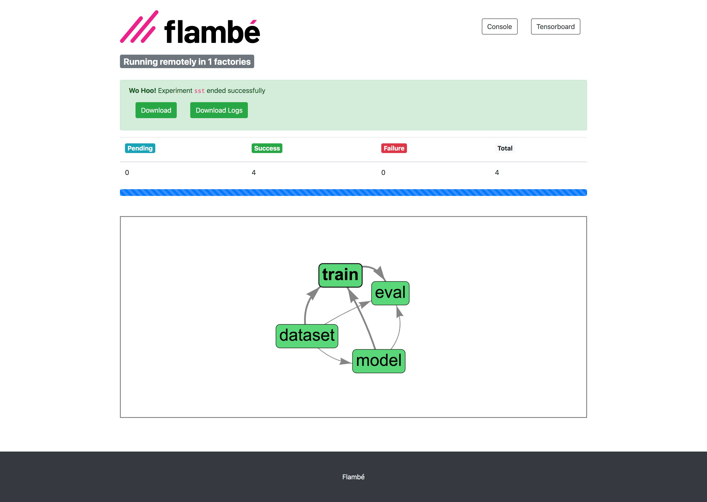
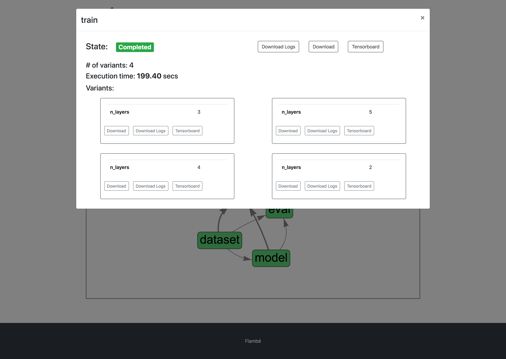
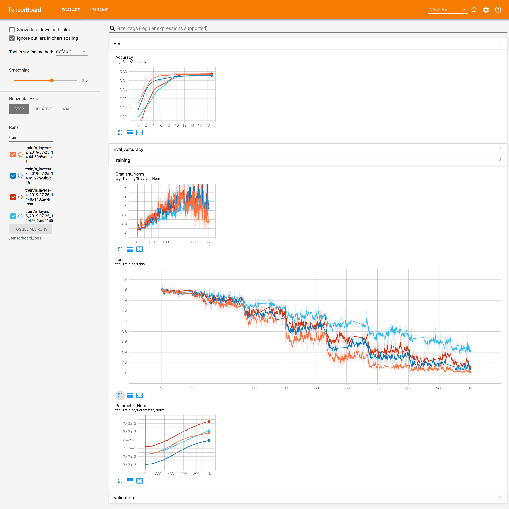

.. _understanding-report-site_label:

===========
Report Site
===========

The report site is a *control center* website where you are able to:

* View the progress of the experiment
* See live logs
* Download all models [remote]
* Access tensorboard [remote]

.. attention:: [remote] means that these features are only available in remote experiments.
In local experiments they are not needed.

Flambé's report site comes included in the **Flambé** package. No further setup is required.

.. important::
    The Report Site is currently compatible with :class:`~flambe.experiment.Experiment`.

How to launch the report site?
*****************************

**Local experiments**

When running local experiments, the console output will give you the exact command
to run in order to run the report site with the appropriate parameters.

**Remote experiments**

When running remote experiments, the report site will automatically start and you
can find the URL in the console output. Remember that it may take a few moments
for everything to start up particularly in a remote experiment.

.. important::
    Users are responsible for making ports 49586 (Report Site) and 49556 (Tensorboard)

**Screenshots**

The Report Site displays a real time DAG of the experiment's pipeline.

.. image:: ../image/report-site/partial.png
    :width: 100%
    :name: report-site
    :align: center

You can access more information by clicking on a block of the DAG.

.. hint::
    The Report Site provides links to Tensorboard with the correct filters
    already applied. For example, you can access Tensorboard only for the ``train``
    block or even for a specific variant.

Once the ``Experiment`` is over, you should see that all blocks are green.
In addition, you will be able to download the artifacts (or just the logs).

Download can be also done at block or variant level.

The Report Site gives you full integration with Tensorboard:

And it also includes a live console for debugging.

.. image:: ../image/report-site/console.png
    :width: 100%
    :name: report-site
    :align: center
